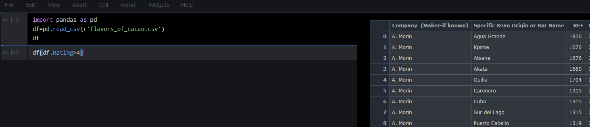
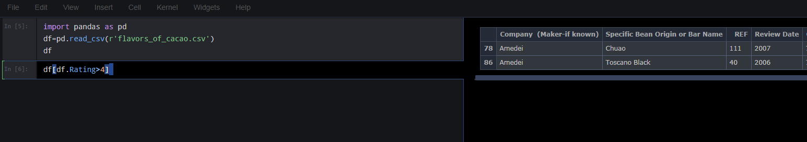

# Jupyter Dev View
Jupyter Dev View contains a style sheet that splits the jupyter output into a side by side view of code cells on the left, and output on the right.   After switching to dev view your notebook will look as follows:



All your code is on the left side on the screen while results for each cell take over the right side of the screen.  To look at a result for any cell you need to switch to it's code cell on the left



### Installing

Installation is through pip.  

```pip install jupyterdevview```

### Using

```
    import jupyterdevview as jdv

    # Switch to dev view
    jdv.dev_view() 
    # Refresh your browser (ctrl-F5 for most browsers)
    
    # Switch back to notebook view
    jdv.notebook_view() 
    # Refresh your browser (ctrl-F5 for most browsers)
```
**NOTE: You will need to restart jupyter after the first time you run jdv.dev_view() for the changes to take effect.  Subsequently you will just need to refresh your browser**

## License

This project is licensed under the MIT License - see the [LICENSE.txt](LICENSE.txt) file for details
